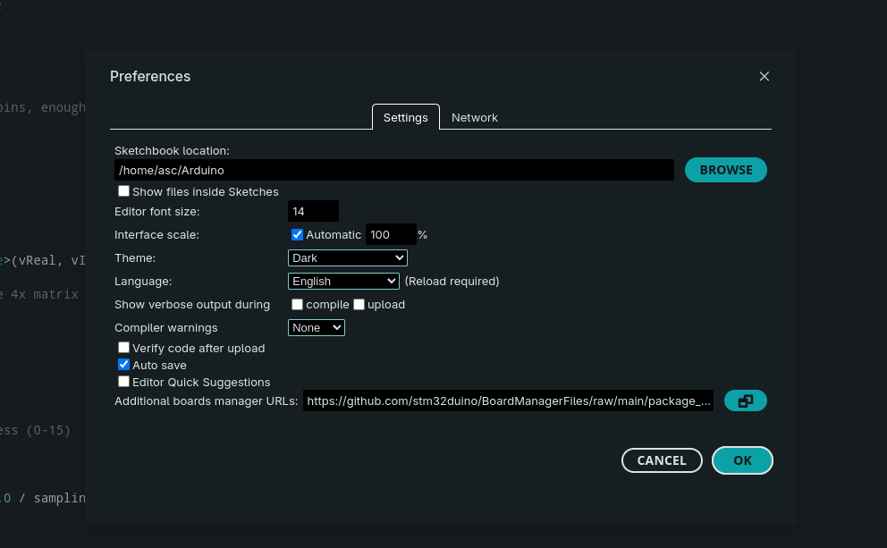
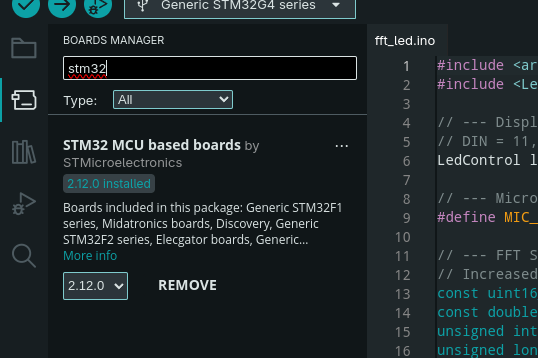
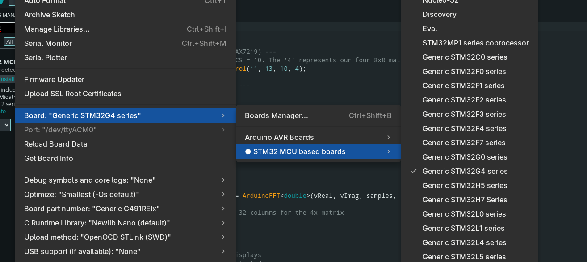
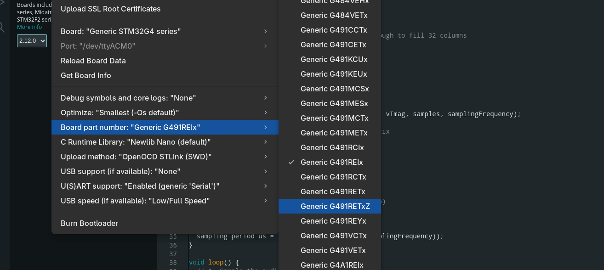
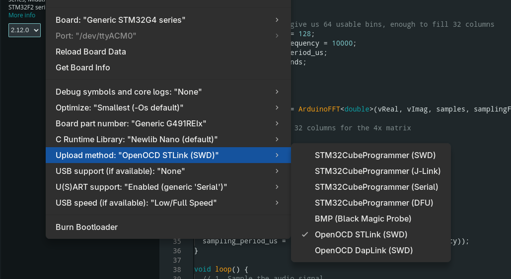

# Quickstart Guide: Programming STM32 Nucleo with Arduino IDE

A lightning-fast, step-by-step guide to setting up and programming STM32 Nucleo boards using the Arduino IDE.

This guide provides the fastest way to get your STM32 Nucleo board (specifically the **Nucleo G491RE**, but applicable to others like the F401) up and running using the familiar Arduino IDE, bypassing the heavier STM32CubeIDE.

## Prerequisites

Before starting, ensure you have the following installed on your system:
1. **Arduino IDE:** Download and install the latest version from the [official Arduino website](https://www.arduino.cc/en/software).
2. **STM32CubeProgrammer:** Required for the STLink drivers and flashing tools. Download it from the [STMicroelectronics website](https://www.st.com/en/development-tools/stm32cubeprog.html).

---

## Step-by-Step Setup

### Step 1: Add STM32 Board Support to Arduino IDE
By default, the Arduino IDE doesn't know how to talk to STM32 boards. We need to provide it with the right board manager URL.

1. Open the Arduino IDE.
2. Navigate to **File** > **Preferences** (or **Arduino IDE** > **Settings** on macOS).
3. Look for the field labeled **Additional Boards Manager URLs**.
4. Paste the following URL into the text box:
   `https://github.com/stm32duino/BoardManagerFiles/raw/main/package_stmicroelectronics_index.json`
5. Click **OK**.

### Step 2: Install the STM32 Board Package
Now that the IDE knows where to look, we can install the STM32 core.

1. Navigate to **Tools** > **Board** > **Boards Manager...**
2. In the search bar on the left, type `STM32`.
3. Look for the package named **STM32 MCU based boards** by STMicroelectronics.
4. Click **Install** and wait for the process to finish. *(Note: This might take a few minutes as it downloads the toolchains).*

### Step 3: Configure Your Specific Board
With the package installed, you need to tell the IDE exactly which hardware you are using.

1. Go to **Tools** > **Board** > **STM32 MCU based boards**.
2. Select your board series. For the Nucleo G491, select **Nucleo-64**. *(If you are using an F4 series like the F401, you would select the appropriate F4 series option here).*

3. Go back to **Tools** > **Board part number**.
4. Select your specific board model: **Nucleo G491RE**.

### Step 4: Set the Upload Method
Finally, we need to configure how the code will be transferred from your computer to the board. 

1. Go to **Tools** > **Upload method**.
2. Select **STM32CubeProgrammer (SWD)** or **OpenOCD**. *(OpenOCD via STLink is usually the most reliable for Nucleo boards).*

---

## Flashing Your First Sketch

Your environment is now completely set up! 

1. Connect your STM32 Nucleo to your computer using a USB cable.
2. Open a basic sketch (like `File > Examples > 01.Basics > Blink`).
3. Hit the **Upload** button. 

If everything is configured correctly, the IDE will compile the code and flash it directly to your STM32 board.
